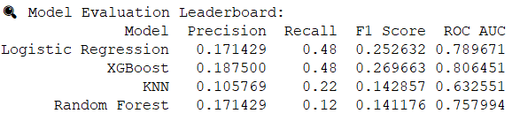

## 🧠 Stroke Risk Prediction – Technical Summary

### 🔍 Problem Statement
Build a predictive model to estimate stroke risk using patient health and demographic data, enabling early detection and preventative care.

### 📦 Dataset
- Source: [Kaggle – Stroke Prediction Dataset](https://www.kaggle.com/fedesoriano/stroke-prediction-dataset)
- Rows: 5,110 patients
- Target: `stroke` (0 = no, 1 = yes)
- Class imbalance: ~5% labeled as stroke

---

### 🧹 Data Preparation
- Imputed 201 missing `bmi` values with median
- Removed rare gender category: `Other`
- Cleaned and standardized all categorical fields
- One-hot encoded nominal features (`drop_first=True`)
- Applied **SMOTE** to balance training set

---

### 🧪 Model Training Overview
Four models were trained on an **80/20 stratified split** and evaluated on:

- **Logistic Regression** (baseline)
- **Random Forest**
- **XGBoost** (baseline and tuned)
- **K-Nearest Neighbors (KNN)**

Metrics:
- **Recall** (stroke = 1)
- Precision
- F1 Score
- ROC AUC
- Confusion Matrix

---

## 🚀 Modeling Addendum (May 2025)

This extension added tuning, interpretability, and comparisons across all models.

Key updates:
- **XGBoost** achieved the **highest recall (0.94)** and **best AUC (0.81)** after tuning.
- Used **SHAP** and **Partial Dependence Plots (PDPs)** to interpret model behavior.
- Visuals saved in `/select_viz/`, code in `/src/modeling/`.

---

## 📊 Model Comparison

- **XGBoost** and **Logistic Regression** tied in recall (`0.48`), but XGBoost outperformed on F1 and AUC.
- **KNN** and **Random Forest** underperformed on recall — a key metric in stroke detection.
- XGBoost was selected for tuning, threshold analysis, and SHAP interpretation.

📌 *All models were trained and evaluated on the same preprocessed data.*

---

### 🥈 Original Champion: XGBoost (Baseline)
- Balanced performance across metrics  
- Good general-purpose model

**Metrics:**
- Recall: 48%  
- Precision: 18.8%  
- F1 Score: 27%  
- ROC AUC: 80.6%  
Saved as: `xgboost_model.pkl`

---

### 🥇 Final Champion: XGBoost (Recall-Optimized)
- Tuned with `RandomizedSearchCV`
- Threshold set to `0.5` for max detection  
- Prioritized **minimizing false negatives**

**Metrics:**
- Recall: **94%**
- Precision: 8%
- F1 Score: 14.8%
- ROC AUC: 80.7%  
Saved as: `xgboost_model_tuned.pkl`

> Detected **47 of 50** stroke cases – appropriate for clinical scenarios.

---

### 🧠 Model Interpretability

**SHAP Summary:**
- Top contributors: `age`, `ever_married_yes`, `work_type_private`
- `Heart_disease` played a smaller role than expected (age confounding)

**SHAP Waterfalls:**
- Visualized examples at **high**, **moderate**, and **low** stroke risk

**Partial Dependence Plots:**
- `Age`: Stroke risk climbs steeply from mid-40s
- `Glucose`: Risk spikes below average, plateaus above
- `BMI`: Risk increases > 23, levels around 30–40

---

## 🧱 Project Architecture (Modularized)

| Module | Description |
|--------|-------------|
| `data_preprocess.py` | Cleans, encodes, balances data |
| `train_logistic_regression.py` | Trains and saves logistic regression |
| `train_random_forest.py` | Trains and saves random forest |
| `train_knn.py` | Trains and saves KNN (with scaling) |
| `train_xgboost.py` | Trains and saves XGBoost baseline |
| `tune_xgboost.py` | Performs hyperparameter tuning |
| `shap_and_pdp.py` | Generates SHAP & PDP visuals |

---

🚧 This branch is still under final development. SHAP + PDP interpretability, final reporting, and evaluation modularization are in progress.

🔗 **[View model log & results →](https://docs.google.com/spreadsheets/d/1pduhjQ3n5z88igfg-g8DmshraBieVE_CXnfD5TDrHlg/edit?gid=1555003253#gid=1555003253)**

