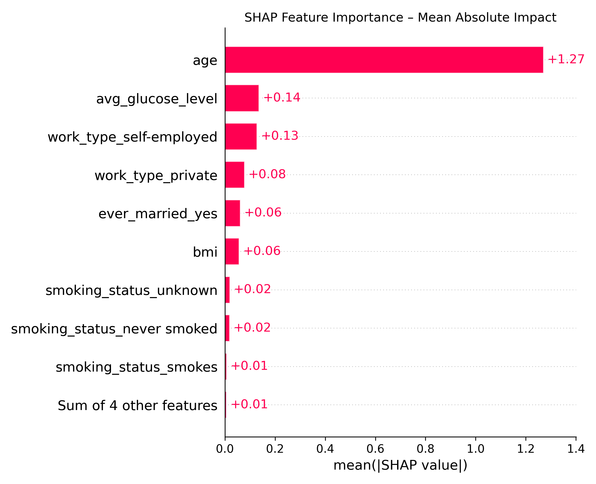
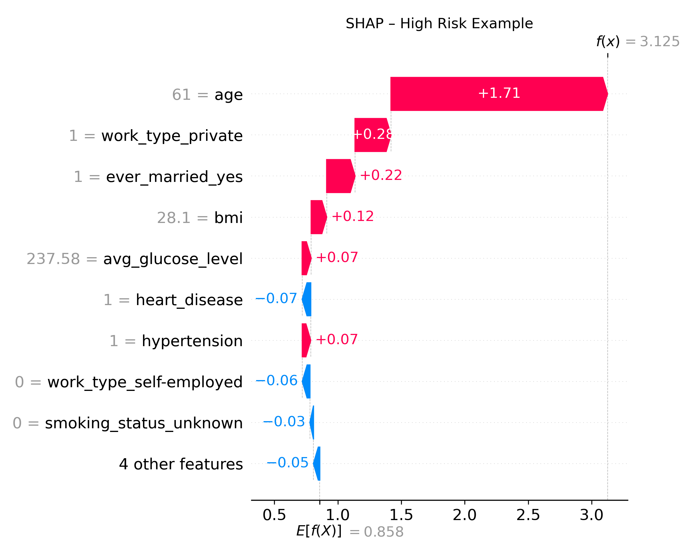
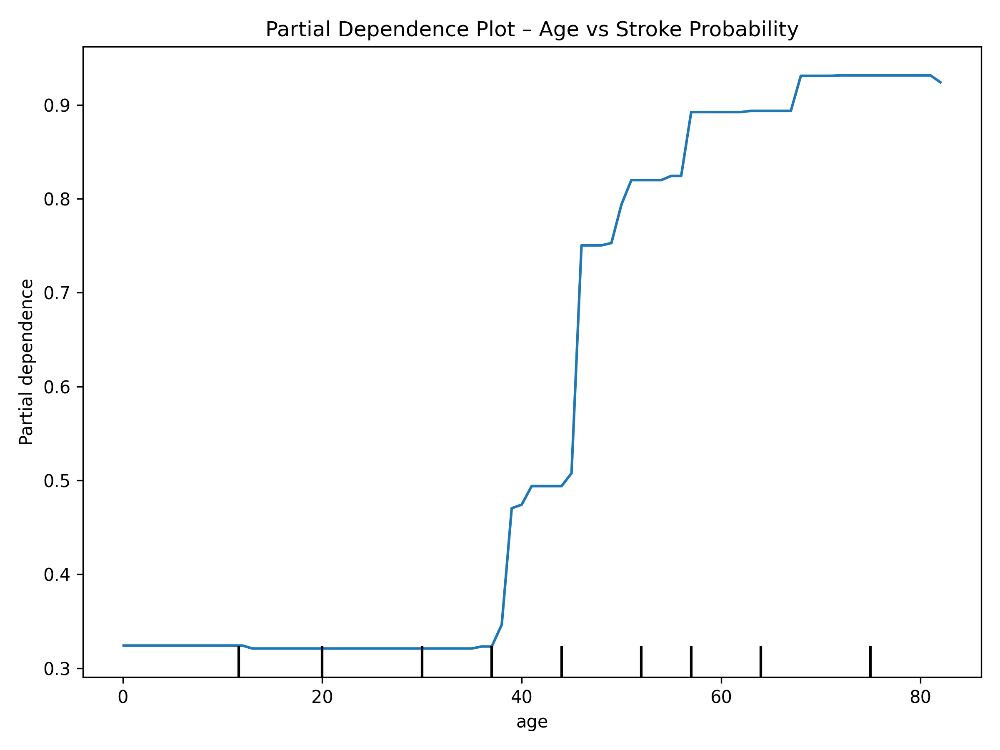

# Stroke Risk Prediction Using Machine Learning
*Multivariate Modeling, SHAP Explanations, and Clinical Recall Optimization*


## Tools & Skills Demonstrated

**Languages & Libraries:**  
- Python (`pandas`, `matplotlib`, `scikit-learn`, `XGBoost`, `imbalanced-learn`, `SHAP`, `joblib`)  
- Google Sheets (EDA planning and logs)  
- Git/GitHub for version control  

**Techniques & Tests:**  
- Feature Engineering and Data Imputation  
- Class Imbalance Handling with SMOTE  
- Statistical Feature Selection:  
  - Chi-Square Test (categorical vs. binary target)  
  - Point-Biserial Correlation (continuous vs. binary target)  
- Machine Learning Algorithms:  
  - Logistic Regression  
  - Random Forest  
  - XGBoost (with hyperparameter tuning and threshold adjustment)  
  - K-Nearest Neighbors (with normalization)  
- Model Evaluation: Confusion Matrix, Precision, Recall, F1, ROC AUC  
- Model Explainability: SHAP Summary + Waterfall Plots, PDPs (Partial Dependence Plots)  

---

## Problem Statement
Build a predictive model to estimate stroke risk using patient health and demographic data, enabling early detection and preventative care.

## Dataset
- Source: [Kaggle – Stroke Prediction Dataset](https://www.kaggle.com/fedesoriano/stroke-prediction-dataset)  
- Rows: 5,110 patients  
- Target variable: `stroke` (0 = no, 1 = yes)  
- Class imbalance: Only ~5% of rows labeled as stroke  

---

## Data Preparation
- Imputed 201 missing `bmi` values using the median  
- Removed rare gender category 'Other'  
- Standardized and trimmed all categorical text fields  
- Applied one-hot encoding (`drop_first=True`) to nominal features  
- Applied SMOTE to oversample minority class in the training set  

## Model Training
Trained and evaluated four models:
- **Logistic Regression** (baseline)  
- **Random Forest**  
- **XGBoost** (baseline and tuned)  
- **K-Nearest Neighbors** (with normalization)  

All models were trained using an **80/20 stratified split** and evaluated on:
- Recall (stroke = 1)  
- Precision (stroke = 1)  
- F1 Score  
- ROC AUC  
- Confusion Matrix  

---

## Modeling Addendum (May 2025)

This extension builds on the original stroke risk analysis by training and comparing four machine learning models:
- Logistic Regression  
- Random Forest  
- K-Nearest Neighbors (KNN)  
- XGBoost (tuned with threshold optimization)  

Key highlights:
- **XGBoost** achieved the highest recall (from 0.48 to 0.94) and AUC (0.81) after tuning 
- SHAP and PDPs were used to explain model decisions and identify high-risk patient profiles
- Visual insights are saved to `/select_viz/` and discussed in the final report

✅ Tuned models and evaluation scripts are located in `/src/modeling/`

---

## Model Comparison

The following leaderboard compares the performance of four machine learning models on the stroke prediction task using the same test set and evaluation metrics:


- **XGBoost** and **Logistic Regression** both achieved the highest recall of `0.48`, but XGBoost had a slightly higher F1 score and ROC AUC
- **KNN** and **Random Forest** underperformed, particularly in recall — a critical metric for identifying high-risk stroke patients
- Based on this comparison, **XGBoost** was selected for further threshold tuning and interpretability analysis using SHAP and PDP

📌 *Note: All models were trained on the same preprocessed dataset and evaluated on the same test set.*  

---

### Final Model: Tuned XGBoost Classifier

This version prioritized **recall** by adjusting class threshold after `RandomizedSearchCV` tuning. It's the most appropriate model for clinical use where missing stroke cases is costly.


- **Recall**: 94%  
- **Precision**: 8%  
- **F1 Score**: 14.8%  
- **ROC AUC**: 80.7%  

> Detected **47 out of 50** stroke cases on test set.

---

## Model Interpretability

### SHAP Summary:
- Top positive predictors: `age`, `ever_married_yes`, `work_type_private`  
- Features like `heart_disease` had less impact than expected due to age confounding  



### SHAP Waterfall:
- Visualized high-risk, moderate-risk, and low-risk cases  
- Clear demonstration of feature contributions at the individual level 

 
 
 

### PDP (Partial Dependence Plots):
- `Age`: Sharp increase in stroke risk starting in mid-40s  
- `Glucose`: Spike in risk at low levels, flat afterward  
- `BMI`: Risk increases above BMI 23, plateaus around 30–40  

 

---

## Project Architecture (Modularized)
- `data_preprocess.py`: Cleaning, encoding, SMOTE, scaling  
- `train_models.py`: Trains and saves all four models  
- `evaluate_models.py`: Loads models, evaluates, generates visuals  
- `shap_and_pdp.py`: Model interpretability via SHAP + PDPs  
- `model_driver.py`: Central controller to run training or evaluation  

---

**Final Report and model analysis visuals available.**  
**[view-model-log](https://docs.google.com/spreadsheets/d/1pduhjQ3n5z88igfg-g8DmshraBieVE_CXnfD5TDrHlg/edit#gid=1555003253)**
**[ML Technical Report](https://jmedinacs.github.io/stroke_risk_ML_addendum/stroke_risk_ml_technical_report.pdf)**

---

## Why This Project Matters

This project simulates a high-recall clinical decision support tool for identifying patients at elevated risk of stroke. By prioritizing recall and using SHAP for explainability, the model supports early intervention — potentially helping healthcare professionals reduce stroke-related complications.

---


## How to Use This Repository

### 1. Clone the Repository
```bash
git clone https://github.com/your-username/stroke-risk-ml-addendum.git
cd stroke-risk-ml-addendum
```

### 2. Install Requirements
Create and activate a virtual environment (recommended), then install dependencies:
```bash
pip install -r requirements.txt
```

### 3. Run the Full Modeling Pipeline
From the project root directory, execute the main pipeline controller:
```bash
python -m pipeline.main
```

This will:
- Load and clean the raw dataset
- Preprocess features (encoding, SMOTE, scaling)
- Train and save all models (Logistic Regression, Random Forest, KNN, XGBoost)
- Evaluate model performance (confusion matrices, metrics, comparison chart)
- Generate SHAP summary, waterfall plots, and PDPs for the tuned model

### 4. Explore Results
Visual outputs are saved to:
- `outputs/figures/` – Confusion matrices, comparison charts
- `select_viz/` – SHAP & PDP interpretability plots

Model files are saved in:
- `models/` – Trained `.pkl` model files

---
