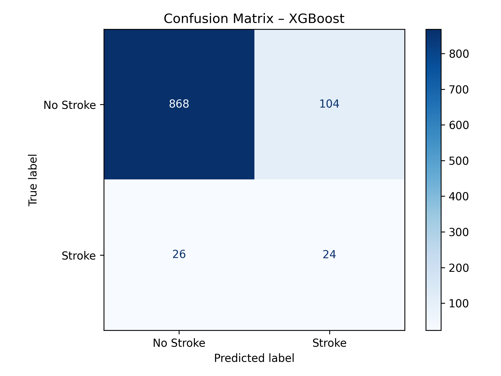

# Stroke Risk ML Addendum

## Overview
This project is a machine learning extension of the original stroke risk data analysis case study. Building on exploratory and bivariate analysis, this phase introduces predictive modeling techniques to identify key stroke risk factors and evaluate their impact on prediction performance.

## Objectives
- Train supervised machine learning models to predict stroke occurrence.
- Use statistical testing and resampling to address class imbalance.
- Evaluate performance with metrics such as ROC AUC, Recall, Precision, and F1 Score.
- Document modeling decisions for transparency and reproducibility.

---

## Data Cleaning Summary
The dataset was cleaned using a modular Python pipeline. Key steps included:

- **BMI Imputation:** Missing BMI values were filled using the median (due to skew).
- **Rare Category Removal:** The single 'other' entry under gender was removed.
- **Text Standardization:** All object fields were lowercased and trimmed to avoid encoding errors.
- **Duplicate Removal:** Dataset checked and confirmed to have no duplicate rows.

Cleaning decisions are fully documented in the [Google Sheets cleaning log](#) (🔗 add your link here).

✅ The dataset is now cleaned and ready for EDA and modeling.

---

## Exploratory Data Highlights

### Target Imbalance

The dataset is highly imbalanced, with only **4.87%** of patients labeled as having had a stroke.

### Categorical vs. Stroke (Chi-Square Test)

Statistically significant features associated with stroke (p < 0.05):

- `heart_disease`
- `hypertension`
- `ever_married`
- `work_type`
- `smoking_status`

Dropped features:
- `gender` and `Residence_type` (p > 0.05)

> Full test results available in the [final report](#) (link coming soon).

### Continuous Features vs. Stroke (Point-Biserial)

- `age`, `avg_glucose_level`, and `bmi` all showed significant correlation with `stroke` occurrence.
- `avg_glucose_level` was right-skewed with a long tail — possible candidate for transformation.
- `age` distribution was relatively even but showed clusters in late 50s and 70s.

---

## Modeling Workflow

1. **Feature Selection**
   - Dropped `gender`, `Residence_type`, and `ID` based on chi-square results and interpretability.
   - Retained categorical and numeric features found to be significant predictors (e.g., `heart_disease`, `hypertension`).

2. **Encoding**
   - Applied one-hot encoding to categorical variables (`drop_first=True`) to reduce redundancy.

3. **Train/Test Split**
   - Used an 80/20 stratified split to maintain the original class imbalance (~4.9% stroke).

4. **Resampling**
   - Applied SMOTE (Synthetic Minority Over-sampling Technique) to training data only.
   - Balanced the minority class (`stroke = 1`) to match the majority class in the training set.

5. **Model Evaluation**
   - Trained Logistic Regression, Random Forest, XGBoost, and KNN.
   - XGBoost produced the strongest performance on both recall and overall ranking ability.

---

### XGBoost – Best Performing Model

Among all tested models, **XGBoost achieved the highest ROC AUC (0.81)** while matching Logistic Regression's 48% recall for stroke detection. This balance between sensitivity and ranking power makes it the most promising candidate for real-world use.

**Performance on the Imbalanced Test Set:**
- **Recall (stroke):** 48%
- **Precision (stroke):** 18.8%
- **F1 Score (stroke):** 27.0%
- **ROC AUC:** 0.81

---

## 🚧 Status
**Project In Progress**

- ✅ Data Cleaning Phase: Completed  
- ✅ Logistic Regression, Random Forest, XGBoost, and KNN: Completed  
- 🔄 SHAP, PDP, and feature importance insights: Coming next  
- 📊 Final report and README polishing: In progress  
